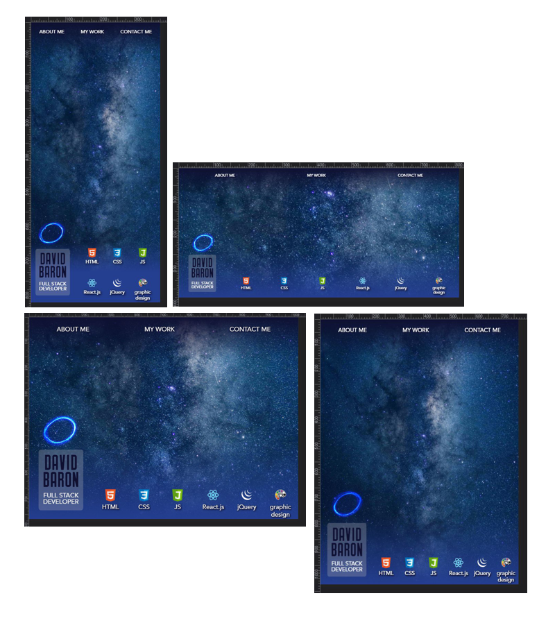

# <Your-Project-Title>Portfolio From Scratch Challenge
## U of T Coding Boot Camp: # 02 Advanced CSS 
### [Installation](#installation)  - [Usage](#usage)  - [Credits](#credits)  - [License](#license) - [Features](#Features)
&nbsp;
## Description
Working on this project was a lot of fun.  I haven't had the chance to use my graphic design skills in a while and I added to them significantly with this project.  I know that this project is the begining of what might be my most important tool when I am on the 'job hunt.'  So, I really pulled out all the stops to create something attention grabbing.  I am sure that I will make many changes and improvements to it as the course progresses.  In this incarnation I focussed on creating flexbox elements that worked with other containers, media querries and CSS variables.

The following is a short description of my experience completing the project:

- I began by experimenting with code to manipulate element attributes using pseudo code.
- I spent a few hours grappling with the effects of different combinations of position and dimension attributes - I think I eventually gained a good understanding of where relative and fixed dimensions are best applied.
- I learned how to make my own SVG files from scratch and then made my own CSS icon and my own JavaScript icon inspired by the HTML 5 icon.  Personally, I think my icons are a modest improvement on the ones currently in circulation as they present the typography more clearly while maintaing the style of the HTML 5 icon.
- I wanted to deliver a unique pop on my site that demonstrated my understanding of transitions and showed my creativity - I got to reuse the glowing blue energy ring I created for my attempt at a YouTube channel. :)
- I continued to apply best practices as I understand them (Source:I read it on the internet! Apparently tables shouldn't be used in nav bars to conform with accessibility standards even though it is a long standing and common practice.) It was just as easy using flex!
- I pushed myself by attempting testing on several actual devices including Motorola, Samsung and Apple phones.  I didn't spend a lot of time in this as it was outside of the scope of the assignment. However, since 'Mobile First' is best practice I thought I should explore the reality of the different mobile devices.
- I attempted to compare the use of BMPs and PNGs.  Using only my rudimentary 'eye-ball test.' I determined that PNGs made sense for larger screens and devices which seem likely to have greater processing power.

## Installation
To set up the website:
 - upload the index.html file along with the assets folder and all of its contents to the host server. 
## Usage
Use this webpage as the landing page of a more extensive website.  A company's presence on the web can provide brand awareness, lead generation, sales, and much more.  

See it online now at: [https://h0rsesh0e.github.io/DavidsPortfolioRepo/]

## Credits
This is my second project in the Coding Boot Camp provided by [The School of Continuing Studies, University of Toronto](https://learn.utoronto.ca/) and [Trilogy Education Services](https://www.trilogyed.com/). I am now a full month into the course (though we took one week off for the winter solstice.  I am thrilled by the power of the tools I have been introduced to and I'm becoming very excited by my anticipation of what must be in store.

## License
All content excluding typefaces, registered trade marks and the public license background image is the exclusive property of David Baron.

## Features
My first version of this website features my own versions of a CSS logo and JavaScript logo modelled on the style of the HTML 5 logo.

It also features an icon for the graphic design section which is entirely my own work.

&nbsp;

&nbsp;

**H0RSESH0E**
